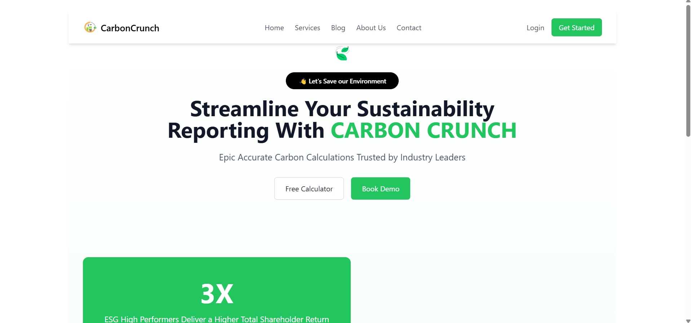
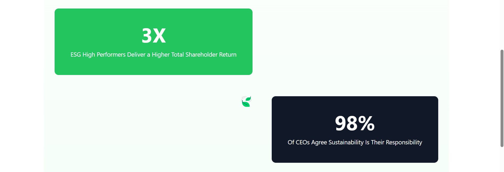
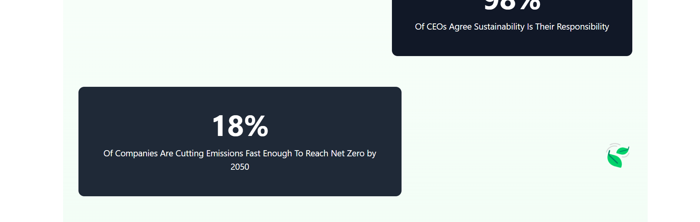
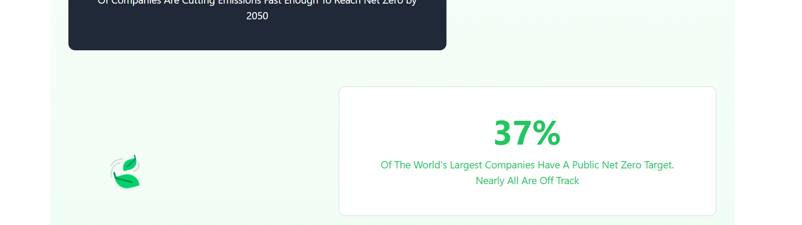

# Technologies Used

## Frontend

- **React.js** - JavaScript library for building user interfaces.
- **Vite** - A fast build tool and development server for modern web projects.
- **Tailwind CSS** - A utility-first CSS framework for styling.
- **PostCSS** - A tool for transforming CSS with JavaScript plugins.

## Animations & UI Enhancements

- **CSS Animations** - Used for interactive elements and smooth transitions.
- **Tailwind Utilities** - For responsive and dynamic UI components.

## Project Configuration & Tooling

- **ESLint** - JavaScript linter for code quality and consistency.
- **Prettier** - Code formatter for maintaining clean code style.
- **Git & GitHub** - Version control and collaboration.

---

# Features

- **Floating Leaf Animation 🍃** - A smooth animated leaf that moves as the user scrolls.
- **Responsive Navigation Bar** - A clean and accessible navigation menu.
- **Hero Section** - A welcoming section with a call-to-action for users.
- **Statistics Section** - Informative data points displayed dynamically.

---

# Preview Images

Here are some visual previews of the project:

---

# Live Link  
- [Carbon Crunch](https://carbon-crunch-roan.vercel.app/)
